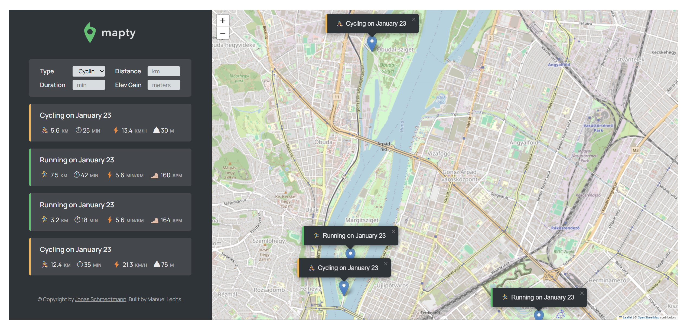
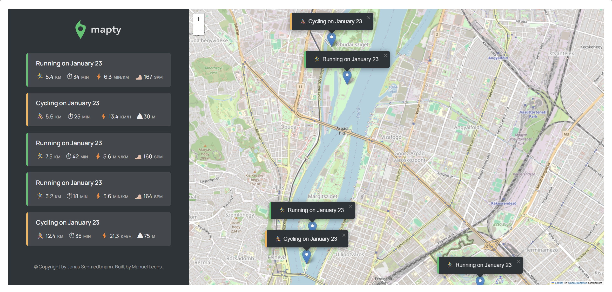

<div id="top"></div>

[](#)
[](#)
[](#)


<div align="center">
  
  <hr>
  <p>
    <b>Mapty</b> is a web application that helps you map, log, and visualize your workouts directly on an interactive map.</br>
    Built with modern JavaScript features and libraries, it provides a clean and user-friendly interface for tracking running and cycling activities.
  </p>
</div>



## Features

- **Interactive Map:** Uses Leaflet.js to display and interact with maps.
- **Workout Types:** Supports logging of running and cycling activities.
- **Workout Details:** Tracks distance, duration, cadence (for running), and elevation gain (for cycling).
- **Dynamic UI:** Updates the UI dynamically as new workouts are added.
- **Local Storage:** Persists workout data so you can revisit it later.

</br>

 

## Technologies Used

- **HTML5:** Structure of the application.
- **CSS3:** Styling and layout design.
- **JavaScript (ES6+):** Core functionality and logic.
- **Leaflet.js:** For interactive map functionality..
- **LocalStorage:** To store and retrieve workouts.

</br>

## Getting Started

1. **Clone the repository**:
    ```bash
    git clone https://github.com/V3n0nX/mapty.git
    ```

2. **Navigate to the project directory**:
    ```bash
    cd mapty
    ```

4. **Open index.html in your browser**:
    ```bash
    open index.html
    ```

</br>

## How to use

<ol>
  <li><b>Enable Location Access:</b> Allow the browser to access your location.</li>
  <li><b>Add a Workout:</b> 
    <ul>
      <li>Click on the map to select a location.</li>
      <li>Fill out the form with workout details.</li>
      <li>Click the "OK" button to save the workout.</li>
    </ul>
  </li>
  <li><b>View Workouts:</b> 
    <ul>
      <li>Workouts are listed in the sidebar.</li>
      <li>Click on a workout to move the map to its location.</li>
    </ul>
  </li>
  <li><b>Reset Workouts:</b> 
    <ul>
      <li>Use the browser console to reset the app:</li>
    </ul>
  </li>
</ol>

```bash
app.reset();
```
</br>

## Acknowledgments
<p>This project is inspired by the JavaScript course by <b>Jonas Schmedtmann</b>.</p>
